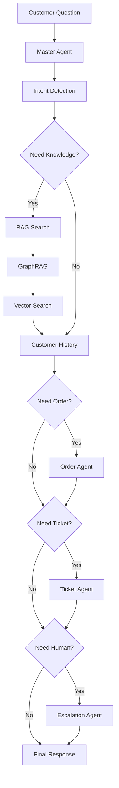

# Agentic Workflow — Customer Question

```text
Customer Question
        │
   Master Agent
        │
  Intent Detection
        │
   Need Knowledge?
        │
       Yes
        │
    RAG Search
        │
     GraphRAG
        │
   Vector Search
        │
  Customer History
        │
    Need Order?
        │
    Order Agent
        │
   Need Ticket?
        │
   Ticket Agent
        │
   Need Human?
        │
 Escalation Agent
        │
  Final Response
```

Each `Need …?` gate can also take **No** and skip that stage.



## Runtime mapping

| Step | Code |
|------|------|
| Master Agent | `backend/app/agents/master/graph.py` |
| Intent Detection | `intent_node` → Intent Classification Agent |
| Need Knowledge? | `needs_knowledge` / `route_knowledge` |
| RAG + Vector Search | `KnowledgeAgent` (embeddings + Qdrant/Pinecone/Chroma) |
| GraphRAG | `GraphRAGAgent` (Neo4j) |
| Customer History | `customer_history_node` (Redis memory + profile) |
| Need Order? | `needs_order` / `route_order` → Order / Package Delay / Refund |
| Need Ticket? | `needs_ticket` / `route_ticket` → Ticket Agent |
| Need Human? | `needs_human` / `route_human` → Human Handoff (Escalation) |
| Final Response | `final_response_node` → Response Synthesizer → LLM |

The executed path is recorded on each reply as `metadata.workflow_path`.
