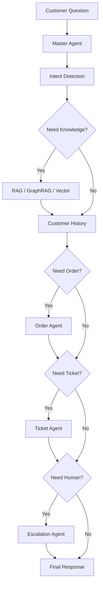

# Complete Architecture

See also the decision-tree flow: [agentic_workflow.md](agentic_workflow.md)

```text
Customer Question
        │
   Master Agent
        │
  Intent Detection
        │
   Need Knowledge? ──Yes──► RAG → GraphRAG → Vector Search
        │
  Customer History
        │
   Need Order? ──Yes──► Order Agent
        │
   Need Ticket? ──Yes──► Ticket Agent
        │
   Need Human? ──Yes──► Escalation Agent
        │
   Final Response (Synthesizer → LLM)
```



## Runtime mapping

| Diagram box | Code |
|-------------|------|
| React Chat UI | `frontend/src/App.tsx` |
| FastAPI Gateway | `backend/app/main.py` + `api/v1/*` |
| Master AI Agent | `agents/master/graph.py` |
| Intent Detection | `agents/intent/agent.py` |
| Knowledge / RAG / GraphRAG | `agents/knowledge` + `agents/graph_rag` |
| Customer History | `customer_history_node` + `memory/conversation.py` |
| Order Agent | `agents/order/agent.py` (+ package delay / refund) |
| Ticket Agent | `agents/ticket/agent.py` |
| Escalation Agent | `agents/handoff/agent.py` |
| Sentiment Agent | `agents/sentiment/agent.py` (enrichment after intent) |
| Recommendation / Email | routed on matching intents within the order gate |
| Final Response | `agents/synthesizer/agent.py` → LLM |

Full agent responsibilities: [docs/agents.md](../agents.md)

## Control flow

1. Gateway authenticates (JWT/OAuth2) and accepts the customer question  
2. Master runs **Intent Detection** (+ sentiment enrichment)  
3. **Need Knowledge?** → RAG Search → GraphRAG → Vector Search  
4. **Customer History** loads conversation + profile  
5. **Need Order?** → Order Agent (or package-delay / refund playbook)  
6. **Need Ticket?** → Ticket Agent  
7. **Need Human?** → Escalation Agent (handoff with summary)  
8. **Final Response** via Response Synthesizer → LLM → customer
