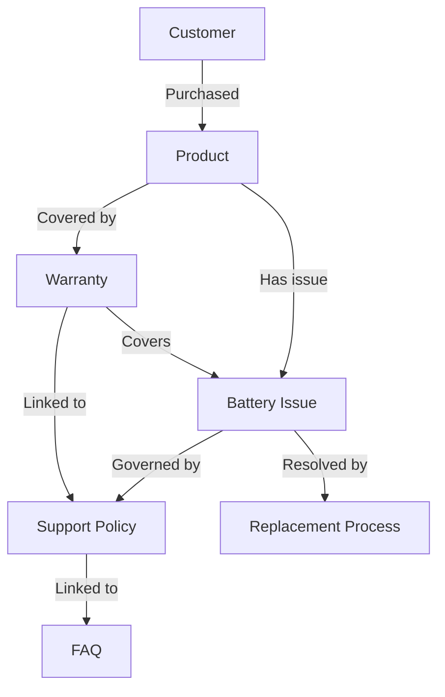

# GraphRAG

## Knowledge Graph

```text
Customer
   │
Purchased
   │
Product
   │
Covered by
   │
Warranty
   │
Linked to
   │
Support Policy
   │
Linked to
   │
FAQ
```



## Example query

> "My laptop battery stopped charging after 7 months."

**GraphRAG discovers**

```text
Customer
   ↓
Laptop
   ↓
Warranty
   ↓
Battery Issue
   ↓
Policy
   ↓
Replacement Process
```

Because 7 months is within the 12-month warranty, guidance points to the covered **Replacement Process**.

## Code map

| Piece | Location |
|-------|----------|
| Knowledge graph seed + path discovery | `backend/app/graphrag/service.py` |
| LangChain-style facade | `backend/app/graphrag/langchain_graphrag.py` |
| GraphRAG Agent | `backend/app/agents/graph_rag/agent.py` |
| Neo4j | optional; in-memory graph used when Neo4j is down |

## API / agent output

`GraphRAGAgent` returns:

- `discovery_path` — e.g. `["Customer","Laptop","Warranty","Battery Issue","Policy","Replacement Process"]`
- `discovery_chain` — human-readable `Customer → Laptop → …`
- `in_warranty` — derived from “N months” in the query vs warranty window
- `schema` — Customer / Purchased / Product / Covered by / Warranty / Linked to / Support Policy / Linked to / FAQ
