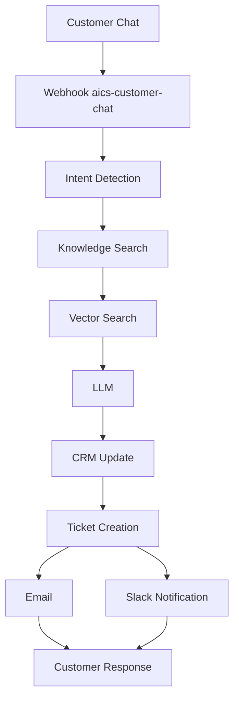

# n8n Workflow — Customer Chat

```text
Customer Chat
      ↓
   Webhook
      ↓
Intent Detection
      ↓
Knowledge Search
      ↓
 Vector Search
      ↓
     LLM
      ↓
  CRM Update
      ↓
Ticket Creation
      ↓
    Email
      ↓
Slack Notification
      ↓
Customer Response
```



## Import

1. Start API on `:8917` and n8n (Compose profile or local).
2. Import `n8n/workflows/customer_chat.json`.
3. Set env `AICS_API_BASE=http://host.docker.internal:8917` (Docker) or `http://localhost:8917`.
4. Activate workflow. Webhook path: **`/webhook/aics-customer-chat`**.

## FastAPI step APIs (called by n8n HTTP nodes)

| Step | Endpoint |
|------|----------|
| Intent Detection | `POST /api/v1/workflows/n8n/steps/intent` |
| Knowledge Search | `POST /api/v1/workflows/n8n/steps/knowledge` |
| Vector Search | `POST /api/v1/workflows/n8n/steps/vector` |
| LLM | `POST /api/v1/workflows/n8n/steps/llm` |
| CRM Update | `POST /api/v1/workflows/n8n/steps/crm` |
| Ticket Creation | `POST /api/v1/workflows/n8n/steps/ticket` |
| Email | `POST /api/v1/workflows/n8n/steps/email` |
| Slack Notification | `POST /api/v1/workflows/n8n/steps/slack` |
| Customer Response | `POST /api/v1/workflows/n8n/steps/response` |
| Run all (no n8n) | `POST /api/v1/workflows/n8n/customer-chat` |

## Example webhook body

```json
{
  "message": "My payment failed.",
  "session_id": "web-123",
  "customer_id": "cust-1",
  "email": "customer@example.com",
  "channel": "web"
}
```

## Related workflows

- `slack_alerts.json` — `aics-slack`
- `email_outbound.json` — `aics-email`
- `ticket_creation.json` — `aics-ticket-created`

Code: `backend/app/workflows/n8n_customer_chat.py`
