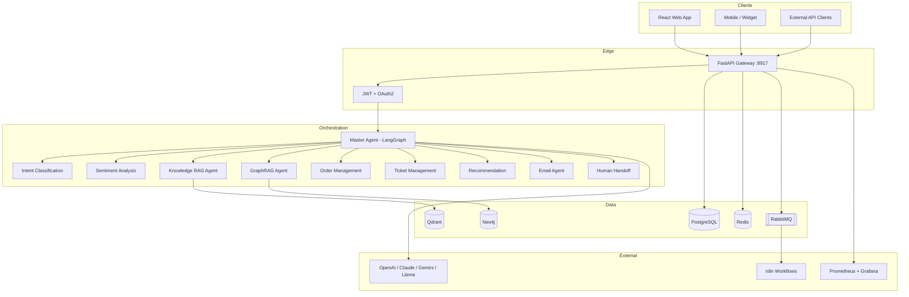
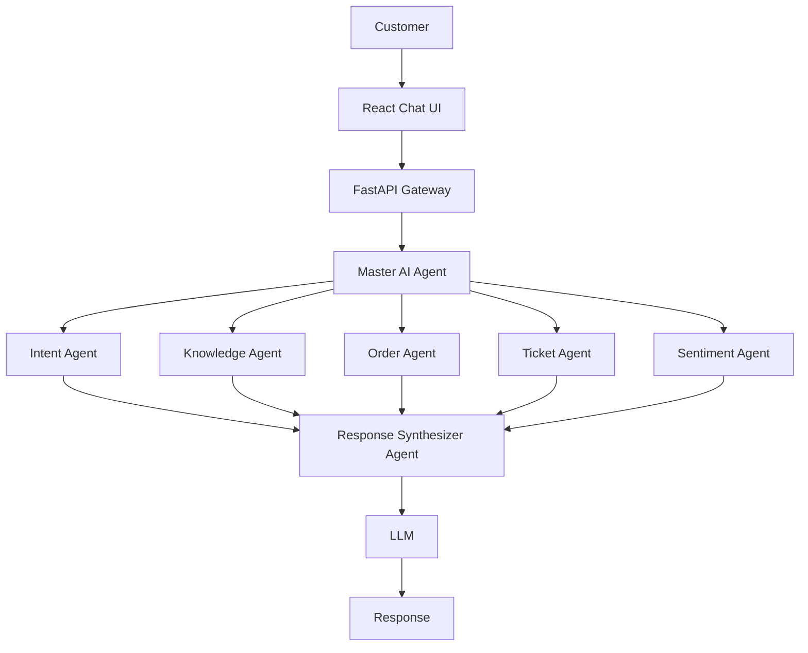

# Architecture Overview

## System context

The **AI Customer Support Platform (AICS)** is an enterprise multi-agent system that answers customer inquiries, resolves order/ticket workflows, retrieves knowledge with citations, and escalates to humans when confidence or risk thresholds are breached.

## Master Agent control flow

See also [complete_architecture.md](complete_architecture.md).

## Module map

| Package | Responsibility |
|---------|----------------|
| `app/api` | REST endpoints (chat, tickets, orders, knowledge, feedback, auth) |
| `app/agents` | LangGraph Master + specialized agents |
| `app/llm` | Interchangeable LLM adapters |
| `app/rag` | Ingestion, chunking, embeddings, vector stores, retrieval |
| `app/graphrag` | Neo4j entity/relationship extraction + hybrid retrieval |
| `app/memory` | Conversation, profile, and long-term memory |
| `app/prompts` | Versioned templates, few-shots, guardrails, A/B tuning |
| `app/workflows` | n8n / RabbitMQ event publishers |
| `app/observability` | Metrics + structured logging |

## API surface (v1)

| Method | Path | Purpose |
|--------|------|---------|
| GET | `/api/v1/health` | Liveness + service map |
| POST | `/api/v1/auth/register` | Create user |
| POST | `/api/v1/auth/token` | OAuth2 password → JWT |
| POST | `/api/v1/chat/message` | Multi-agent chat |
| CRUD | `/api/v1/tickets` | Ticket management |
| POST | `/api/v1/orders/lookup` | Order lookup |
| POST | `/api/v1/knowledge/ingest` | Knowledge ingestion |
| POST | `/api/v1/feedback` | CSAT / quality feedback |
| GET | `/metrics` | Prometheus scrape |

## Non-functional requirements

- **Security:** JWT access/refresh, bcrypt passwords, CORS allowlists, request IDs
- **Reliability:** Agent confidence thresholds, human handoff, retries via RabbitMQ
- **Observability:** structlog JSON in prod, Prometheus histograms/counters, Grafana dashboards
- **Portability:** Docker Compose for local, Kubernetes for prod
- **Extensibility:** Adapter pattern for LLMs, embeddings, and vector stores

## Deployment topology

- **Local API:** `0.0.0.0:8917`
- **Compose profiles:** default (API + data), `full` (+ Neo4j/n8n/frontend), `observability`
- **K8s:** `k8s/base` + overlays for `dev` / `prod`
