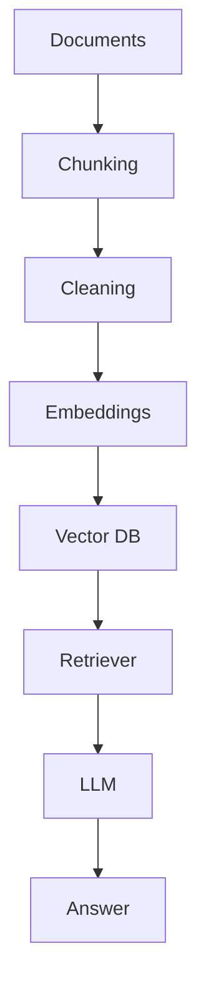

# RAG Pipeline

## Knowledge Sources

| Source | Label |
|--------|--------|
| PDFs | `pdfs` |
| Product Manuals | `product_manuals` |
| FAQs | `faqs` |
| Policies | `policies` |
| Knowledge Base | `knowledge_base` |
| Emails | `emails` |
| Release Notes | `release_notes` |
| Internal Documentation | `internal_documentation` |

Sample content lives in `sample_data/documents/` and is seeded on API startup.

## Pipeline

```text
Documents
   ↓
Chunking
   ↓
Cleaning
   ↓
Embeddings
   ↓
Vector DB
   ↓
Retriever
   ↓
LLM
   ↓
Answer
```



## Code map

| Stage | Module |
|-------|--------|
| Documents (PDF/DOCX/HTML/MD/email) | `backend/app/rag/ingestion/loaders.py` |
| Chunking | `backend/app/rag/chunking/splitter.py` |
| Cleaning | `backend/app/rag/cleaning.py` |
| Embeddings | `backend/app/rag/embeddings/` (OpenAI / BGE Large / E5 Large / Sentence Transformers) |
| Vector DB | `backend/app/rag/vectorstores/` (Qdrant / Pinecone / Chroma) |
| Retriever | `RAGPipeline.retrieve` |
| LLM → Answer | `RAGPipeline.answer` |
| Orchestration | `backend/app/rag/pipeline.py` |
| Knowledge Agent | `backend/app/agents/knowledge/agent.py` |

## API

- `GET /api/v1/knowledge/sources` — source types + pipeline stages  
- `POST /api/v1/knowledge/ingest` — index text (`knowledge_source` optional)  
- `POST /api/v1/knowledge/ingest/upload` — index PDF/DOCX/HTML/MD/email  
- `POST /api/v1/knowledge/search` — Retriever only  
- `POST /api/v1/knowledge/answer` — Retriever → LLM → Answer  
